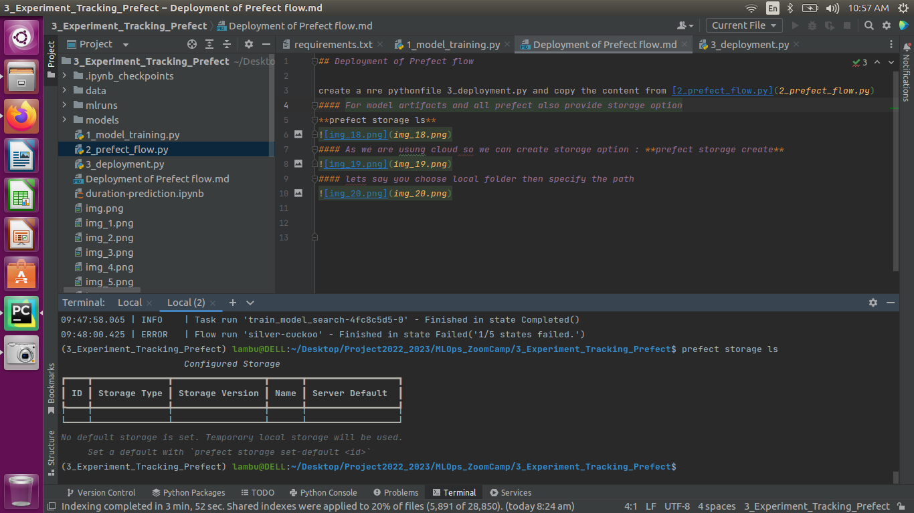

## Deployment of Prefect flow

create a new pythonfile **3_prefect_deployment.py** and copy the content from [2_prefect_flow.py](2_prefect_flow.py)
#### For model artifacts and all prefect also provide storage option
**prefect storage ls**

#### As we are usung cloud so we can create storage option : **prefect storage create**

#### lets say you choose local folder then specify the path and give a storage name

So whenever we register somethings the metadata will save in the .**prefect** folder

#### Now in 3_prefect_deployment.py remove the main() func. and import deployment specifications and run using 
**prefect deployment create 3_prefect_deployment.py**

#### you can create a workqueue for schedule task

you will get a workqueue id to copy

in terminal you can type **prefect work-queue preview <work-queue-id>** to get scheduled task

#### we can start any scheduled task by prefect agent start <ID>

!!END

