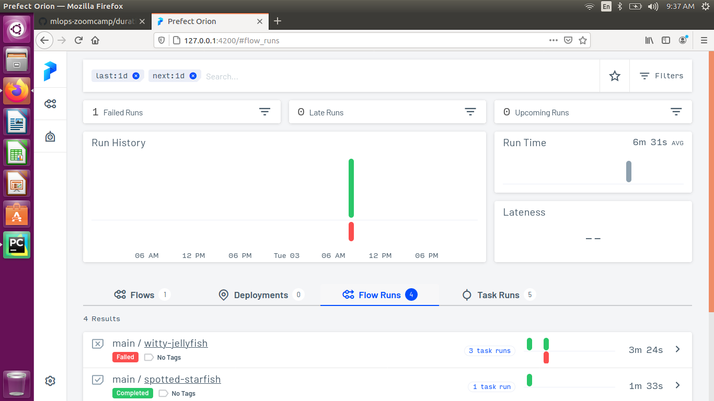
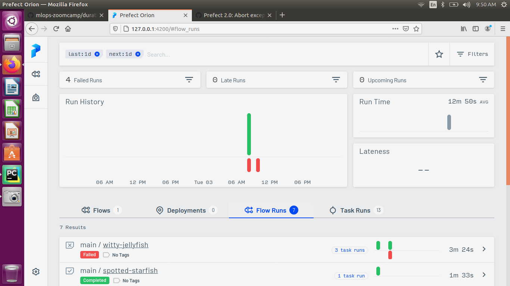
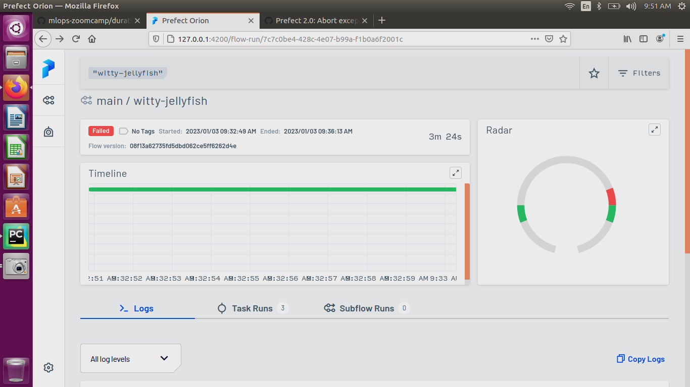
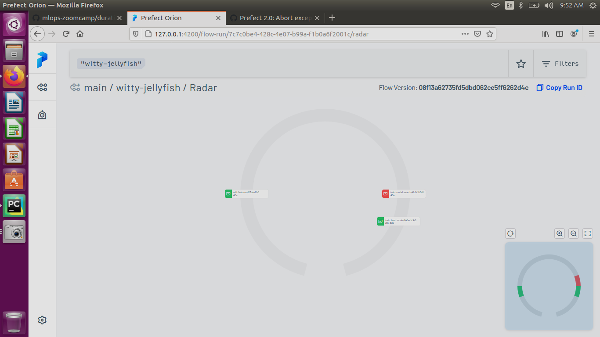

## Prefect Orion Flow and Model Orchestation

####  Copy data and notebook from previous module and copy stuffs from notebook to 1_model_training.py

#### Copy 1_model_training.py and create another 2_prefect_flow.py

#### from 2_orefect_flow.py to access prefect orion dashboard type **prefect orion start**

#### url : http://127.0.0.1:4200 

#### if you add functions as @task you can observe from ui

#### when you have multiple functions indise main and they are working independently.

#### prefect uses task_runner as ConcurrentTaskRunner()

