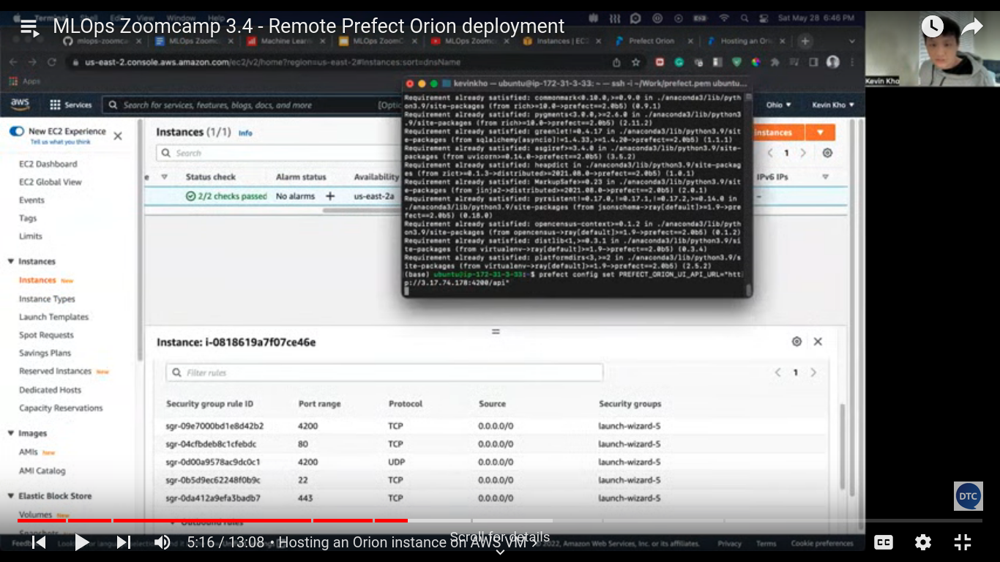

## Remote Prefect Orion deployment

#### create a AWS EC2 instance and make it running

Now we need to add necessary security groupd rule to that particular instance

Add security rules like HTTP, Custom TCP, Custom UDP and HTTPS

Just reverify from instance that all the security groups have been added or not.

#### Now copy the public ip and from local using ssh connect to that instance

Install the required packages using **requirements.txt**

### **Refer this for more clarity**

#### now set the config for prefect and set external ip as public ip

you can reverify config by **prefect config view**

#### now you can start the orion : **prefect orion start --host 0.0.0.0**

#### now conect to public ip with port 4200 i.e. : <public_ip>:4200

#### you can configure prefect config from any IDE as well using http:// and run the flow

#### now refresh the ui to see the flow

