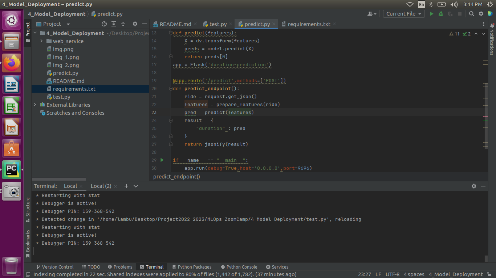

## Model Deployment

#### Here we will take the model saved in model folder from module 1 and deploy it using web service Flask
#### Create a folder web_service and cpy the **lin-reg.bin** model from module 1 model folder
#### Install the **requirements.txt**
#### Create a new python file **predict.py** for basic model loading and prediction

#### Create python file **test.py** for validation the prediction

#### now test the **test.py**

#### now lets turn this into a flask application
#### in **predict.py** create another function predict_endpoint() using flask and run the application

#### then run **test.py** file

### but for production server we need gunicorn => **pip install gunicorn**
#### we can run the application through gunicorn using
**gunicorn --bind 0.0.0.0:9696 predict:app**
Initially stop the flask server then run the gunicorn command and test it using test.py

## Packaging the app to Docker
#### create a Dockerfile
FROM python:3.9-slim                                         -> The python image it will download
RUN pip freeze > requirements.txt                            -> Installing the required packages
WORKDIR /app                                                 -> Setting a working dir
COPY ["predict.py","test.py","web_service/lin_reg.bin","./"] -> copy required files to current directory
EXPOSE 9696                                                  -> Exposing the port to run
ENTRYPOINT ["gunicorn","--bind=0.0.0.0:9696","predict:app"]  -> Running the gunicorn

#### Now Building the docker
docker build -t ride-duration-prediction-service:v1 .

#### Now for testing the docker image
docker run -it --rm -p 9696:9696 ride-duration-prediction-service:v1

-it -> running in interactive mode
--rm -> remove the image after using it
-p   -> for port

### So we have docker container running so we can deploy anywhere using the docker image.

