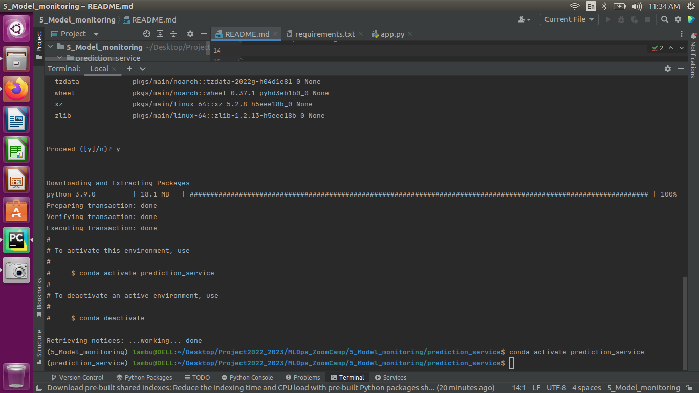
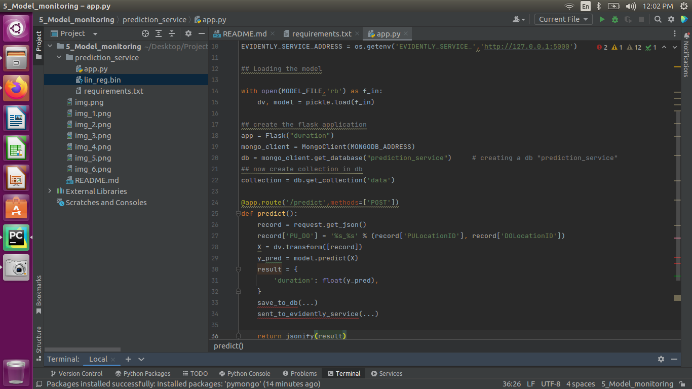

## Model Monitoring

#### So how to prepare for it ? -> Monitoring

#### Most of production models iterated in batch mode.

## create a dir prediction_service
#### inside that create a app.py file and copy the lin_reg.bin,requirements.txt file from previous module
#### inside prediction_service create a conda env **prediction_service**

in that env install requirements.txt

prepare the app.py file based on prepare.py file of 4th module 

Now create a dockerfile to save all so that we can run the services through docker compose

#### to install docker compose run **sudo apt-get install docker-compose** from terminal

from the official link i.e. https://github.com/DataTalksClub/mlops-zoomcamp/blob/main/05-monitoring/docker-compose.yml
copy the **docker-compose.yml** file and change the python version to 3.9
Now up the docker using **docker compose up**

now from previous module copy test.py file into current dir

## modify the readme

#### downloading files using prepare.py file

#### now up the docker compose : **docker-compose up --build**

# Need to modify the readme

    

