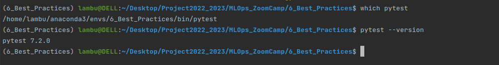

## Best Practices

### Unit Testing
#### Here we will implement unit testing in this project. Unit Testing is nothing but testing individual functions one by one

#### There is a directory **Mlops_project_semicon-main** and from there copy train.py

#### create a env with python=3.9

#### create a tests folder 

#### create a requirements.txt file and install pytest, pandas, scikit-learn

#### then **pip install -r requirements.txt**

#### configure pytest by running which pytest, pytest --version

#### now inside tests create __init__.py so that python can understand it is a package

#### go through train.py file properly

#### here we will test basic two functions implemented in train.py

#### so create a new python file model_test.py  there import train from Unit_testing

#### test the train.py if everything works well

#### testing test_read_data_task function and test_preprocess_data_task from train.py using pytest

### So we have successfully Done the Unit Testing !!! 

